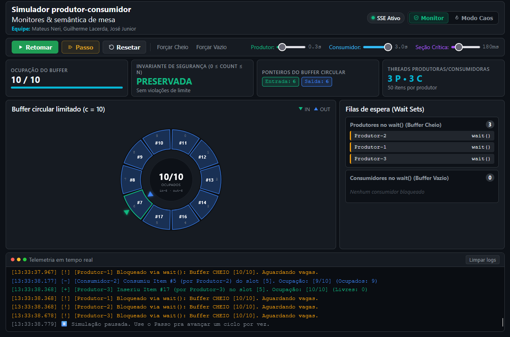

# Simulador do Produtor-Consumidor com Monitores Nativos

**Universidade do Estado do Rio Grande do Norte (UERN)**  
**Departamento de Ciência da Computação (DCC)**  
**Disciplina:** Sistemas Operacionais  

### Equipe
* **Mateus Gomes Neri**
* **Guilherme de Sousa Lacerda**
* **José Junior de Medeiros Andrade**

**Vídeo de apresentação:** [Clique aqui](arquivos/apresentacao.mp4)

---

## 1. Visão Geral do Projeto



Este projeto implementa a solução canônica para o clássico problema de sincronização concorrente **produtor-consumidor com buffer limitado (*bounded buffer*)**, proposto por Edsger Dijkstra, utilizando **monitores**.

A aplicação foi desenhada com dupla finalidade:
1. **Lógica:** Implementação de monitores com exclusão mútua estrita, variáveis de condição sob **semântica de mesa (*mesa semantics*)** e garantia formal de invariantes de segurança.
2. **Ambiente lúdico:** Um *dashboard* web responsivo com visualização circular orbital em SVG do buffer, controle de passo a passo (*step-by-step*), ajuste em tempo real de latências e alternância a quente para o **Modo Caos**, permitindo observar empiricamente as anomalias de corrida (*Race Conditions*, *Lost Updates*, *Overflows* e *Underflows*).

O sistema opera sobre uma arquitetura desacoplada:
* **Núcleo concorrente:** Totalmente independente de bibliotecas de terceiros, utilizando apenas primitivas da linguagem (`synchronized`, `wait()`, `notifyAll()`) e o servidor HTTP embutido do JDK (`com.sun.net.httpserver.HttpServer`).
* **Telemetria:** Despacho simultâneo de eventos para o terminal do sistema operacional (com cores ANSI) e para a interface web via streaming contínuo **Server-Sent Events (SSE)** em `/api/stream`.
* **Interface web:** Desenvolvida em HTML5, CSS3 moderno e JavaScript puro, empacotada diretamente dentro do arquivo executável `.jar`.

---

## 2. Princípios de concorrência e estratégia Utilizada

### 2.1 O Problema clássico do buffer limitado
No modelo de cooperação concorrente entre processos/threads, múltiplos **produtores** geram itens de dados e os inserem em uma estrutura de memória compartilhada circular de capacidade finita $N$, enquanto múltiplos **consumidores** retiram e processam esses itens.

As regras fundamentais do problema exigem:
* **Exclusão mútua:** Duas threads não podem acessar ou modificar simultaneamente os índices (`in`, `out`) e o arranjo de compartimentos do buffer.
* **Bloqueio em buffer cheio:** Se $count = N$, os produtores devem suspender sua execução até que surjam vagas liberadas por consumidores.
* **Bloqueio em buffer vazio:** Se $count = 0$, os consumidores devem suspender sua execução até que novos itens sejam depositados por produtores.
* **Invariante de segurança:** Em qualquer instante de tempo, a quantidade de itens no buffer deve respeitar $0 \le count \le N$.

---

### 2.2 conceito e estrutura de monitores
Um **monitor** é uma abstração de alto nível para sincronização que encapsula:
1. O estado interno compartilhado (dados privados).
2. As operações de manipulação (métodos públicos sincronizados).
3. Uma trava implícita (*mutex lock*) garantindo que apenas uma thread esteja ativa dentro do monitor por vez.
4. Variáveis de condição que permitem threads suspenderem temporariamente sua execução liberando o lock e aguardando um sinal de notificação.

Em Java, o monitor é intrínseco a cada objeto (`Object monitor`). A exclusão mútua é obtida com a palavra-chave `synchronized`, enquanto a sincronização condicional utiliza os métodos `wait()` e `notifyAll()`.

---

### 2.3 Semântica de mesa (*mesa style*) vs. Semântica de Hoare
A literatura de sistemas operacionais divide os monitores em duas vertentes principais:
* **Semântica de hoare (*Signal-and-Wait*):** Ao sinalizar, a thread sinalizadora imediatamente cede o processador e o lock para a thread acordada. A condição de guarda é garantida no momento em que a thread retoma.
* **Semântica de mesa (*Signal-and-Continue*):** Ao invocar `notifyAll()`, a thread notificadora continua sua execução até liberar o lock. A thread acordada não executa imediatamente; ela passa do estado de espera (*wait set*) para a fila de prontas (*ready list*) e precisará competir novamente pelo lock do monitor quando este for liberado.

Como outras threads podem competir e alterar o estado do buffer antes que a thread acordada reassuma o lock, **a condição de guarda deve ser obrigatoriamente testada dentro de um laço `while`**, prevenindo acordamentos espúrios (*spurious wakeups*):

```java
// Proteção do Produtor sob Semântica de Mesa:
while (count == capacidade) {
    despachante.despachar(eventoBloqueioCheio);
    wait(); // Libera o monitor e aguarda na fila de espera do SO
}
```

```java
// Proteção do Consumidor sob Semântica de Mesa:
while (count == 0) {
    despachante.despachar(eventoBloqueioVazio);
    wait(); // Libera o monitor e aguarda na fila de espera do SO
}
```

---

### 2.4 Prevenção de starvation e deadlock
O uso de `notify()` simples seleciona arbitrariamente apenas uma única thread da fila de espera. Se um produtor acorda outro produtor quando o buffer acabou de encher, a thread acordada voltará a dormir no `while`, deixando todos os consumidores dormindo indefinidamente (*Lost Wakeup Problem* / *Deadlock*).

Por esse motivo, o projeto adota estritamente `notifyAll()`, assegurando que todas as threads interessadas reavaliem suas condições de guarda, garantindo progresso contínuo (*Liveness*) e ausência de inanição (*Starvation*).

---

### 2.5 Controle de execução (pausa e passo a passo)
Para fins didáticos, foi criado o monitor especializado [`ControleExecucao.java`](src/main/java/br/edu/uern/prodcons/threads/ControleExecucao.java). Ele funciona como uma barreira de controle antes que qualquer produtor ou consumidor acesse o buffer:
* Ao pausar a simulação, todas as threads suspendem cooperativamente via `wait()`.
* Ao acionar o botão **Passo**, um contador de passos atômico é incrementado e o monitor dispara `notifyAll()`. Exatamente uma thread consome a permissão e executa um ciclo de produção ou consumo, retornando ao estado de pausa logo em seguida.

---

### 2.6 Demonstração das anomalias (modo caos)
Para comprovar a necessidade teórica dos monitores, o sistema disponibiliza o [`BufferCaos.java`](src/main/java/br/edu/uern/prodcons/monitor/BufferCaos.java), que remove as palavras-chave `synchronized` e as primitivas `wait/notify`. Com o modo caos ativado:
* **Lost Update:** Dois produtores acessam o mesmo índice `in` concorrentemente, sobrescrevendo itens antes que sejam lidos.
* **Race Condition no Contador:** As operações `count++` e `count--` não são atômicas, corrompendo a contagem do buffer.
* **Buffer Overflow e Underflow:** Produtores inserem além da capacidade ($count > N$) e consumidores tentam ler posições nulas ($count < 0$).
* **Hot-Swap Dinâmico:** É possível alternar entre Monitor e Caos em tempo real com a simulação em andamento; o motor migra os itens e ponteiros sem travar threads.

---

## 3. Estrutura do Código-Fonte

A árvore completa do projeto segue a convenção canônica do Apache Maven:

```
prodcons-monitores/
├── pom.xml                                           # Configurações do Maven (Java 21, empacotamento JAR)
├── README.md                                         # Documentação técnica oficial da atividade
│
├── arquivos/
│   ├── apresentacao.mp4                              # Vídeo demonstrativo da aplicação
│   └── image.png                                     # Imagem de captura do simulador
│
├── src/
│   └── main/
│       ├── java/
│       │   └── br/edu/uern/prodcons/
│       │       ├── Principal.java                    # Ponto de entrada CLI e inicialização do servidor
│       │       │
│       │       ├── model/                            # Modelos de dados e contratos
│       │       │   ├── Item.java                     # Entidade imutável que trafega no buffer (id, produtor, timestamp)
│       │       │   └── IBufferLimitado.java          # Contrato polimórfico (Strategy) do buffer limitado
│       │       │
│       │       ├── monitor/                          # Implementações de buffer (com e sem sincronização)
│       │       │   ├── BufferMonitorSincronizado.java# Monitor canônico com synchronized, wait, notifyAll e semântica de Mesa
│       │       │   └── BufferCaos.java               # Buffer desprotegido para demonstrar anomalias de corrida
│       │       │
│       │       ├── threads/                          # Ciclo de vida concorrente e controle
│       │       │   ├── ThreadProdutor.java           # Thread trabalhadora que fabrica itens e insere no buffer
│       │       │   ├── ThreadConsumidor.java         # Thread trabalhadora que retira e consome itens do buffer
│       │       │   ├── ControleExecucao.java         # Monitor para controle de pausa, retomada e modo passo a passo
│       │       │   └── MotorSimulacao.java           # Orquestrador do pool de threads, cotas e alternância a quente de modo
│       │       │
│       │       ├── telemetria/                       # Barramento de eventos e logs
│       │       │   ├── EventoSimulacao.java          # Registro imutável de estado (snapshot do buffer, contadores, mensagens)
│       │       │   ├── RegistradorConsole.java       # Impressão formatada no terminal com cores ANSI por categoria
│       │       │   └── DespachanteEventos.java       # Barramento thread-safe para notificar ouvintes (console e SSE)
│       │       │
│       │       └── server/                           # Camada HTTP e streaming de eventos (JDK padrão)
│       │           ├── ServidorHttpEmbutido.java     # Configuração e inicialização do HttpServer na porta 8080
│       │           ├── ManipuladorApiControle.java   # Endpoints REST de comando (/api/control/* e /api/status)
│       │           ├── ManipuladorFluxoSse.java      # Canal de streaming Server-Sent Events (/api/stream)
│       │           ├── ManipuladorArquivosEstaticos.java # Entrega dos recursos estáticos empacotados no JAR
│       │           └── ManipuladorCors.java          # Tratamento de cabeçalhos CORS e requisições OPTIONS
│       │
│       └── resources/
│           └── public/                               # Frontend web nativo integrado
│               ├── index.html                        # Dashboard com anel SVG, painéis de métricas, wait sets e terminal
│               ├── style.css                         # Folha de estilos moderna em tema escuro com layout responsivo
│               └── app.js                            # Cliente JavaScript: consome SSE, gerencia animações e botões
```

---

## 4. Requisitos de Ambiente

Para compilar e executar o projeto, são necessárias as seguintes ferramentas instaladas e configuradas no `PATH` do sistema:

* **Java Development Kit (JDK):** Versão 21 LTS (ou superior).
* **Apache Maven:** Versão 3.8+ (ou superior).

Para verificar a instalação no terminal:
```bash
java -version
mvn -version
```

---

## 5. Como Compilar e Empacotar

A partir do diretório raiz do projeto (`prodcons-monitores`), execute o comando padrão do Maven:

```bash
mvn clean package
```

Este comando executa as seguintes etapas:
1. Limpa a pasta `target/`.
2. Compila todos os 17 arquivos Java de `src/main/java` com target Java 21.
3. Copia os arquivos da interface web (`index.html`, `style.css`, `app.js`) para o classpath do pacote.
4. Gera o arquivo JAR executável autossuficiente em:
   ```text
   target/prodcons-monitores-1.0.0.jar
   ```

---

## 6. Instruções de Execução Local

### 6.1 Modo Padrão (Interface Web + Streaming SSE + Terminal)
Executa a aplicação completa com o servidor HTTP nativo:

```bash
java -jar target/prodcons-monitores-1.0.0.jar
```

1. O servidor será iniciado na porta **8080**.
2. Abra o navegador em: [http://localhost:8080](http://localhost:8080).
3. Na interface gráfica, você pode:
   * **Iniciar / Pausar / Retomar:** Controle unificado da execução.
   * **Passo a passo:** Executar exatamente um ciclo atômico de thread por vez.
   * **Alternar monitor / modo caos:** Interruptor no topo para demonstrar a diferença entre exclusão mútua e anomalias concorrentes em tempo real.
   * **Atalhos:** "Forçar Cheio" (produtores rápidos e consumidores lentos) e "Forçar Vazio" (produtores lentos e consumidores rápidos).
   * **Ajustar velocidades:** Sliders dinâmicos para tempos de produção, consumo e retenção de seção crítica.
